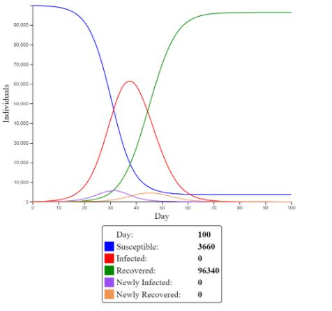

---
jupyter:
  jupytext:
    formats: ipynb,md
    text_representation:
      extension: .md
      format_name: markdown
      format_version: '1.2'
      jupytext_version: 1.6.0
  kernelspec:
    display_name: Python 3
    language: python
    name: python3
---

<!-- #region toc-hr-collapsed=false -->
 **41189 Modelling Assignment — Group 6**
 
 Topic: Measuring both the spread of Covid-19 and society’s response to preventative measures to the pandemic
 
 Group members:
 
 - Jordan Boulous
 - Alex Rebello
 - Cameron Solomon
 - Raymond Lam
 
<!-- #endregion -->

<!-- #region toc-hr-collapsed=false -->
# 1. Introduction
<!-- #endregion -->

## 1.1 State the problem, why it is important/relevant to you and/or more broadly to society


<!-- #region -->
This report will be focused on investigating the Covid-19 pandemic, government lockdown measures and society’s subsequent response. Covid-19 is an extremely infectious disease, transmitted through droplets of coughs, sneezes or exhales generated by an exposed person. Since the discovery of the new strain of Coronavirus, it has infected over 31.4 million people worldwide and taken the lives of over 966 thousand people. Australia has over 27 thousand confirmed cases with 850 fatalities (ABS, 2020). Although Australia has seen somewhat subsided Coronavirus cases in comparison to the world, government intervention has been swift and stringent. March 23rd, a landmark date for unprecedented government intervention with the Morrison administration announcing a ban on all non-essential services (M. Grattan, 2020) Society was brought to a halt, businesses were forced to shut and citizens were encouraged to adhere to stay-at-home orders (M. Grattan, 2020). Businesses that were deemed ‘essential’ also bore the brunt of the virus as most citizens were too scared to venture outside their homes. As businesses suspended trading many found themselves without a job, the unemployment rate rising to 6.8%, compared to 5.3% last year (ABS, 2020). With so many of the population out of work, there has also been a reduction in consumer spending, reduced by 20 per cent compared to the pre-pandemic norm (ABS, 2020). 

During the introduction of the government’s lockdown measures, citizens were mostly obedient, following stay-at-home orders which kept Coronavirus daily cases below 100 (ABS, 2020). However, Victorians have been subject to longer, more stringent lockdown measures as a result of a spike in Coronavirus cases. As seen on the 30th of July, Victoria recorded 723 new cases, the largest spike in Australia (ABS, 2020). Victorians have been subject to 2 months of Stage 4 Lockdown. have started to question the government’s lockdown measures (VIC GOV, 2020). Residents are citing the economic damage and the seeming eternal extensions of lockdown measures as reasons for their protests and riots (M. Paul, E. Clure, 2020). Over 300 Victorians have been caught protesting on September 5th, in a bid to end their Stage 4 lockdown (M. Paul, E. Clure, 2020). It is evident a small portion of society is dissatisfied with government intervention in regards to Covid 19, with residents complaining about the length and the strict enforcement of lockdown measures. 
Finally, this report aims to outline the eventual distribution of vaccines. A Covid-19 vaccine is hoped to prevent the virus from infecting the immune system. Vaccines are rumoured to be available to Australians within the next year, with the Morrison government securing over 84 million doses (S. Morrison, 2020). However, a study by Iposos surveyed over 20,000 adults to test their willingness to take a vaccine. In Australia, it was found that 1 in 10 adults would choose not to get vaccinated and only a 59% acceptance rate worldwide (Iposos, 2020). Iposos cites fear of side effects (56%) and doubt of effectiveness (29%) as reasons for declining the vaccine. 
 
 
 
 
 
IPSOS. 2020. ‘Australias say they would get vaccainted for Covid-19’ https://www.ipsos.com/en-au/9-10-australians-say-they-would-get-vaccinated-covid-19

The Hon Scott Morrison MP. 2020. ‘Australia secures onshore manufacturing agreements for Covid-19 Vaccines’ https://www.pm.gov.au/media/australia-secures-onshore-manufacturing-agreements-two-covid-19-vaccines

ABS. 2020. ‘People and Communities, Household impacts of Covid-19 Survery’ https://www.abs.gov.au/statistics/people/people-and-communities/household-impacts-covid-19-survey/latest-release

ABS. 2020. ‘Employment and Unemployment Statistics’ https://www.abs.gov.au/statistics/labour/employment-and-unemployment/labour-force-australia/latest-release

ABC. 2020. ‘Victoria Coronavirus lockdown’ https://www.abc.net.au/news/2020-08-07/victoria-coronavirus-lockdown-economy-parliament-quarantine/12533214

Health Gov. 2020. ‘Immunisation and Vaccines’ https://www.health.gov.au/health-topics/immunisation/about-immunisation/how-does-immunisation-work#:~:text=Vaccines%20strengthen%20your%20immune%20system&text=Vaccines%20use%20dead%20or%20severely,protect%20you%20against%20future%20infection.

ABC. 2020. ‘Melbourne Coronavirus restrictions lockdown protests, police.’ https://www.abc.net.au/news/2020-09-05/melbourne-coronavirus-restrictions-lockdown-protests-police/12633164

<!-- #endregion -->

<!-- #region toc-hr-collapsed=false -->
# 2. Context, background information, justification
<!-- #endregion -->

## 2.1 Research and review literature, news, digital media, drivers and how the problem is being addressed by academia, industry, government, etc.


- Archana, C., Pavan, J. & Satish, S. 2020. ‘COVID 19: Outbreak, Structure, and Current Therapeutic Strategies.’, Sakun Publishing House, vol. 11, no. 7, pp. 6825-6835. http://web.b.ebscohost.com.ezproxy.lib.uts.edu.au/ehost/pdfviewer/pdfviewer?vid=1&sid=5681bd2d-ac79-472a-8acc-63536f582b70%40sessionmgr101 

This article gives a detailed description of COVID-19 and includes details about the original outbreak in Wuhan, forms of transmission, virion structure, physicochemical properties, replication, methods of diagnosis, treatment and precautions to prevent spread. The contents of the text are complete, clearly documented and use a variety of different resources to ensure accuracy. It also used very recent information that was available and despite being released in July, the article is still relevant in September. The authors study pharmacy, biomedical science and life science - so there may be some vested interest and bias due to the authors studying similar courses.
The article states that person-to-person transmission is likely for COVID-19 and is primarily spread through direct contact and droplets from a cough or sneeze. However, it was also found in stool samples, the gastrointestinal tract, saliva and urine. It also states that the SARS-CoV-2 (COVID-19) virion is spherical with a diameter of 80-120nm, contains a non-segmented, positive-sense RNA genome and contains numerous glycoproteins. Diagnosis and testing involves a swab and is often performed when a patient experiences fever, a sore throat, dry cough, dyspnea or they were in contact with a recent confirmed case.
Preventative measures include wearing face masks and other personal protective equipment (gloves), good hand hygiene, social distancing, isolation and quarantine. Rapid diagnosis, vaccines and therapeutics are critical in managing the COVID-19 pandemic.


- Australian Government, 2020. ‘What you need to know about coronavirus (COVID-19)’, Department of Health.https://www.health.gov.au/news/health-alerts/novel-coronavirus-2019-ncov-health-alert/what-you-need-to-know-about-coronavirus-covid-19 

This news page from the Australian Government explains what COVID-19 is, symptoms and what to do if you have them, how it spreads, at risk demographics, preventative measures, how to get tested and the post-testing process. As it is written by the government, the information is complete, accurate and comes from a reliable source. The page and the pages for the individual states are constantly being updated as the situation progresses.
The page also examines the symptoms of COVID-19 as the previous article did, although this is in a more concise manner. It explains how the seriousness of COVID-19 can range from a mild illness to pneumonia and how some recover quicker than others. It lists the same symptoms as the article (fever, cough, shortness of breath, sore throat) as well as uncommon symptoms. If an individual experiences any of these symptoms, they are advised to get tested and contact the ‘Coronavirus Helpline’ which provides 24/7 support. It is important to isolate after getting tested. The demographics most at risk according to the page are travellers who have recently been overseas, those who have been in contact with someone with COVID-19, people in correctional facilities and people in group residential settings. If an individual has been overseas, they must isolate for 14 days and testing is important. Those most at risk of serious illness include older people and people with compromised immune systems, disabilities or chronic conditions. The page also covers the same preventative measures as the article as well as avoiding public gatherings, and give links to explain how each measure is effective. Many places of academia and businesses apply these preventative measures to prevent the spread of COVID-19. 
Various other government pages are available for each state and territory which discuss the different preventative measures and management of COVID-19. One of these include ‘Financial assistance for businesses’ on the NSW page as many businesses are struggling financially due to people isolating.


## 2.2 Identify the system + stakeholders. For this, you will need to construct a “rich picture” that captures the essential elements.


Agent Based Model- Stakeholders: The Government, Customers, Employees, Media, Trade Unions, Communities, Vendors 

Schelling’s Segregation Model- Stakeholders: The Government, Customers, Employees, Media, Trade Unions, Communities, Vendors 

Riot Models- Stakeholders: The Government, Customers, Employees, Media, Trade Unions, Communities, Vendors 

Each stakeholder affects each system in the same way:
- The Government- The models that we use will have to comply with government laws and regulations. 
- Customers- Models will be served to customers needs in order to prevent COVID 19.
- Employees- The employees that are hired to carry out the actions of the model play a pivotal role on the outcome of the model’s functionality. 
- Media- The media will play a role in promoting the different models and provide specific information on it. 
- Trade Unions- Trade Unions will provide a safe and happy work environment with the employees of the trade unions. 
- Communities- Communities will provide feedback to the models that are used to prevent COVID 19. 
- Vendors- Companies that construct models will purchase different materials and parts from vendors. 


## 2.3 Identify current models or prevailing frames that are being used to address the problem


<!-- #region -->
Models are a way to simulate a population’s behavior. By understanding models, they can be used to assist with predictions, designs and actions (UML, 2013). Government leaders all over the world are utilizing hundreds of models in an effort to understand and inhibit the transmission of the Coronavirus (ABC, 2020). Although the specific relationship between Covid cases, riots and lockdown measures have not yet been thoroughly investigated, both government agencies and private businesses have made extensive records of Covid 19 cases. Currently, the Australian Government is using Compartmental SEIR models led by the Doherty Institute as a basis for important decisions (J. Janson, 2020). The Compartmental SEIR model uses compartments as a means to simplify the mathematical modelling of infectious diseases. SEIR refers to the different states the population can exist in; susceptible, exposed, infectious and recovered. As the compartmental model is represented by an exponential decay, meaning there is an asymptote at zero infected individuals (J. Janson, 2020). 


In an effort to prohibit the transmission of the Coronavirus, governments all over the world have issued varying levels of lockdown and stay-home measures. However, by enforcing these orders and saving lives, private businesses are facing hardships as customers are scarce and money is tight. As stated by PWC’s report “We estimate that over a year , a coronavirus pandemic could reduce Australia’s GDP by $34.2 billion”. PWC have used the Global Trade Analysis model (GTAM) which is “a multi-region global, multisector, computable general equilibrium model”. A similar approach was adopted by the Commonwealth Treasury during the SARS outbreak of 2002-03. The GTAM is a mathematical model that uses a “back casting exercise”, which analyses data from previous years or instances in order to model its current task. The GTAM uses a plethora of data in an attempt to cover as many aspects of the economy as possible. 


Currently, there are no specific models investigating the acceptance of vaccines. This is due to the mysterious nature of the Coronavirus and doubts surrounding the existence of a vaccine. There are however, numerous studies surrounding the acceptance of vaccines both before and during the Covid-19 pandemic. According to the Centre for Countering Digital Hate (CCDH), there has been a surge of activity from anti-vaccine groups with an estimated 7-8 million new members since 2019 (Lancet, 2020). There is also a growing number of Covid-19 disbelievers since the pandemic started, groups led by people with questionable credentials as mentioned in the article by L. Golman (2020). 


James J. 2020. https://www.youtube.com/watch?v=kS__P0N5JVs&feature=youtu.be&ab_channel=JamesJansson

James L. PWC. 2020. ‘Economic Consequences as a result of COVID19’ pp 2-10 https://www.pwc.com.au/publications/australia-matters/economic-consequences-coronavirus-COVID-19-pandemic.pdf

LANCET. 2020. Talha B. ‘The online anti-vaccine movement in the age of COVID-19’  VOL 2, ISSUE 10, E504-E505 https://www.thelancet.com/journals/landig/article/PIIS2589-7500(20)30227-2/fulltext

Ryan C. 2020. ‘Tensions flare at LA Civic Center over coronavirus stay-home orders’ https://www.dailynews.com/2020/05/01/la-city-hall-protestors-plan-to-decry-coronavirus-stay-home-order/

UML. 2013. ‘The Importance of Modelling’ 
http://umlguide2.uw.hu/ch01lev1sec1.html

<!-- #endregion -->

## 2.4 Discuss how prevailing models/frames are preventing the problem from being fully addressed or solved


Current SEIR models are significantly preventing COVID 19 from being fully addressed and solved. SEIR models currently are overly pessimistic, such that they depict the worse effects that COVID 19 can have on individuals (Sun, 2020). By expressing these worse case scenarios depicts an inaccurate depiction of COVID 19 as currently not everyone is facing the worse off effects with many of them experiencing small to mild effects. Another issue that occurs from SEIR models is exponential decay occurs within these models. This negatively portrays the actual number of COVID 19 cases suggesting that COVID cases will never reach 0 cases. In reality this is incorrect because once a vaccine is developed there will be no COVID 19 cases, which is uncorrelated to the SEIR models exponential decay function. 

Sun, K (2020, June 18). SEIR modeling of the COVID-19 and its dynamics. SpringerLink. https://link.springer.com/article/10.1007/s11071-020-05743-y 
 
Big Data models also are other models that are preventing COVID 19 to be fully solved. Big Data Models have the main purpose of suggesting how many cases of COVID 19 per day or all together in a certain country or population. This doesn’t solve the issue of COVID 19 as it only shows the number of cases and does not depict ways in which the pandemic can be dealt with. Also Big Data Models also show an inaccurate number of COVID 19 cases as in many developing countries, several cases go unreported (Lau, 2020). This doesn’t provide a true addressment of the actual number of COVID 19 cases in these countries. This also has a strong negative effect on the analysis of this data as the data analysis will be inaccurate in terms of the characteristics of COVID 19 cases in different countries (Lau, 2020). 

Lau, H (2020, June 22). Internationally lost COVID-19 cases. ScienceDirect. https://www.sciencedirect.com/science/article/pii/S1684118220300736 

<!-- #region toc-hr-collapsed=false -->
# 3. Conceptual Models
<!-- #endregion -->

## 3.1 Based on your self-study of the supermarket of models, explain the three models that you have chosen to look at the problem


#### Agent Based Model:
Agent based models attempt to simulate the real world in a 1:1 ratio. This is done by simulating the actions and interactions of autonomous agents that can be individuals or collectives, while assessing and analysing their effects on the system as a whole. This behaviour is based on their relations with the other agents. 
Individual agents are characterised as a rational thinker, meaning that they behave as such to optimise their goals using heuristics. One way to interpret this is ecological rationality. This could involve an individual looking over a fence and copying their neighbour if they are doing a task better, or keep doing the same thing while occasionally trying something new. The basic idea is to imitate, exploit and explore. The decisions an individual makes propagates through a complex network of interactions and the surrounding environment.
To simulate the real-world and complex systems, agent based models simulate the actions and interactions of autonomous agents. These agents may observe their environment, adapt to it and learn new principles that alter their way of thinking. 

#### Schelling’s Segregation Model:
Schelling’s segregation model is an agent based model created by Thomas Schelling. Schelling wanted a reason as to why people of different races and incomes tend to segregate in most parts of the developed world. It explains how an individual will segregate based on the behaviour of the surrounding agents or neighbours.
Imagine a NxN checkerboard. Some people (represented by squares) receive a higher salary AP and the others have a lower salary BP where P represents an individual. If I belong to the former category AP and most of my neighbours also belong to AP and hence AP ≥ BP, then I decide to stay. However, if most of my neighbours belong to BP and AP < BP, then I will relocate so that AP ≥ BP.
Everyone uses this heuristic where someone decides to move or stay depending on the ratio of people who are alike. It should be noted that a micro-motive does not equal macro-behaviour in Schelling’s segregation model.

#### Riot Models (Granovetter Threshold Theory):
Granovetter’s riot model is utilised in order to measure an individual’s willingness to make a decision based on the decisions of those around them (the rioters). Each person has a threshold and if the number of rioters exceeds that threshold, the person joins in.
N individuals indexed by i have a riot threshold, T(i) ∈ (0, 1, …, N), i.e T(i) is contained in the set of all possible, real number thresholds including 0; T(i) ∈ {ℝ+0}. Initially, any individual with a riot threshold of zero, T(i)=0, joins the riot. R(t) equals the number of people rioting at time t. Individual i participates at time t if T(i) < R(t-1).
This model reveals the importance of the entire distribution of thresholds rather than just the mean. It also shows the difficulty of predicting social movements and which ones will be successful.
An application of this is a group of 5 people deciding whether to wear a mask. If 0 people are wearing it and everyone has a threshold of 1 or more, nothing happens and nobody wears a mask. However, if the threshold order is 0, 1, 1, 2, 2, everyone will end up wearing a mask because the person at the start takes the initiative to wear it.


## 3.2 Explain how each of the three models works (brief) and how it will be applied in your case.


#### Agent Based Model:
Agent based models are used to simulate the interactions between different agents, which may include individuals in a society, in order to monitor and analyse the behaviours of each autonomous agent based on their relations with other agents, also ensuring to comprehend their influence on the surrounding environment.
Using the agent based model, we can establish the rates of infection and recovery according to the selected solutions. Agent-based models can be used to predict outcomes for an array of different scenarios in the Covid-19 predicament, providing reliable calculated estimates of the deaths, recoveries and infections for different preventative measures. With the application of this model, we are able to track the virus’ impact on individual agents, with constant updates occurring in order to provide a reliable model with relevant data based to assist with the tracking of infection and recovery in the Covid-19 global crisis. This can accentuate the success or failure of different preventative measures since the simulations can be compared to determine the most and least effective methods to diminish the impact of the virus.


#### Schelling’s Segregation Model:
Schelling’s segregation model is used to simulate the way in which individuals naturally segregate based on their personally selected threshold of similarity in the agents surrounding them.
With the Schelling’s segregation model, we are able to witness the behaviours of different individuals in society during the Covid-19 pandemic, measuring their happiness and comfortability in regards to their neighbours’ willingness to accept vaccines. Hence, we are able to witness the effects of emotional segregation in different communities according to different ‘similarity rates’, which are the percentage of people surrounding individuals that they wish to be vaccinated in order to be satisfied. This is useful in regards to the possible solutions to the Covid-19 pandemic since it can be used to predict the contentment of individuals in a society after a vaccine is released, providing insight into the amount of vaccinations that need to be produced in order to create a general sense of comfort.


#### Riot Model (Granovetter Threshold Theory):
Riot models, when taking into consideration the Granovetter threshold theory, are utilised in order to measure an individual’s willingness to make a decision based on the decisions made by people around them. Each individual has their own personal threshold, which when exceeded will result in them making a certain decision, mimicking the behaviours of those around them.
Through the use of riot models, with a specific focus on the Granovetter threshold theory, it has been made evident that we can effectively measure the threshold for different individuals to participate in accepting the vaccine and thus ‘joining the riot’. This is necessary information as it allows us to be able to recognise the number of willing participants based on the different thresholds in a society. Hence, this data can be utilised to predict the amount of vaccines that must be produced, and can also be used to predict the amount of people with specific thresholds required in order to flatten the curve representing the growth of Covid-19.  


## 3.3 Describe any data sources (real or hypothetical) that are needed to construct the three models. Use illustrative drawings and diagrams where possible

<!-- #region -->
#### Agent Based Model:
Agent based models take into consideration the number of degrees for each individual agent. This is necessary, as the degrees, or the connections, allow the model to measure the amount of interactions that each infected model may have. Also, the individual recovery rate is considered in the agent based model, with the average of 14 days being applied to agents after they have been recognised as infected. 

- Covid agent based model without lockdown being implemented as a preventative measure:



This model is simulating the spread of covid-19 in a group of 100,000 agents over 100 days, assuming that 100 people are initially infected. These individuals are said to have an average of 20 connections, with a 1.4% chance of spreading the virus to those agents. Also, the recovery rate is approximately 14 days after an individual is infected.


- Covid agent based model with lockdown being implemented after 15 days of the virus being present in society:


This model keeps all the same characteristics as the prior model, except after 15 days, lockdown was forced upon society, which is said to reduce interactions by 90% and will last 85 days.


Covid-19 Demonstration Model. (2020). Retrieved 20 September 2020, from http://covidagentmodel.com/
<!-- #endregion -->

<!-- #region -->
#### Schelling’s Segregation Model:
Using the segregation model provided by NetLogo, we are able to input our own similarity rate to measure the behaviours of individuals when they require X% of individuals around them to have been vaccinated in order to be satisfied.
- Segregation Model with 0% similarity rate (0% of neighbours must be vaccinated)


Individuals are not at all segregated


- Segregation Model with 25% similarity rate (25% of neighbours must be vaccinated)


Individuals are still fairly mixed with non-similar agents, but slightly segregated


- Segregation Model with 50% similarity rate (50% of neighbours must be vaccinated)


Individuals are heavily, but not entirely, segregated


- Segregation Model with 75% similarity rate (75% of neighbours must be vaccinated


Individuals are almost entirely segregated.

Wilensky, U. (1997). NetLogo Segregation model. http://ccl.northwestern.edu/netlogo/models/Segregation. Center for Connected Learning and Computer-Based Modeling, Northwestern University, Evanston, IL.

<!-- #endregion -->

#### Riot Model (Granovetter Threshold Theory):
In order to use the riot model effectively, we must estimate the thresholds of individuals in a society. Assuming that the ‘riot’ action is accepting a vaccination as a preventative measure to Covid-19, then there are different hypothetical scenarios which could occur:
- If a sample of 100 individuals is taken and the lowest threshold of an individual T(i) = 1, then nobody will take the vaccine. 
- In order to correct this, there must be an individual with T(i) = 0, which is likely for desperate individuals or individuals with a strong incentive to take the vaccine. Hence, for each individual with T(i) = 0, the number of people rioting R(t) will increase by 1. 
- Then, for each other individual, the following formula, T(i) >= R(t) is applied. If true, then they will accept the vaccine and R(t) will increase. 
- Eventually, either everyone will accept the vaccine, or those with extremely high thresholds will never accept the vaccine.

Hence, in order to apply this model, a sample of the population would need to provide their own personal threshold which would result in them accepting the vaccine as a preventative measure to the Covid-19 pandemic.

<!-- #region toc-hr-collapsed=false -->
# Implementation
<!-- #endregion -->

## Describe the mathematical and/or statistical implementation of your three models. This should be done using Python code.

```python

```

```python

```

```python

```

<!-- #region toc-hr-collapsed=false -->
# Scenario analysis, sensitivity + uncertainty evaluation
<!-- #endregion -->

## Establish baseline parameter sets and or configuration for output scenarios

```python

```

```python

```

```python

```

## Perform a basic sensitivity analysis, i.e., identify with parameters are most sensitive/insensitive for the outputs

```python

```

```python

```

```python

```

<!-- #region toc-hr-collapsed=false -->
# Proposed solutions
<!-- #endregion -->

## Discuss potential portfolio of solutions based on your previous analysis


```python

```

```python

```

```python

```

<!-- #region toc-hr-collapsed=false -->
# Reflection on group + individual approach to assignment
<!-- #endregion -->

## Each student should discuss their experiences about working on the project. The document should be no more than 1000 words per group member. It should discuss following key aspects:

- Your contribution in the project
- Other group members’ contributions
- What positives do you take from this project? What did you learn from this project?
- What challenges did you face in this project and how you overcame those?
- If you are faced with dealing with a real-world problem and need to do some modelling, how would you determine which modelling approach to take. Justify your response.


### Group member 1 reflection

```python

```

### Group member 2 reflection

```python

```

### Group member 3 reflection

```python

```

### Group member 4 reflection

```python

```
