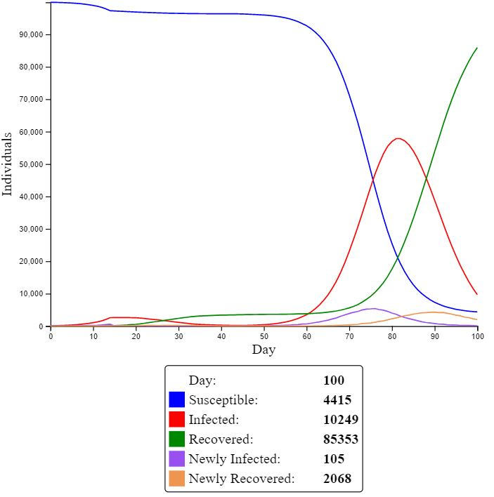
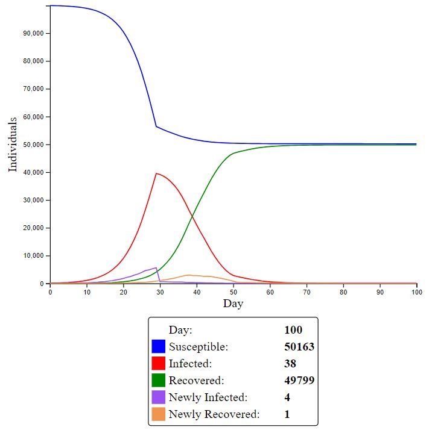
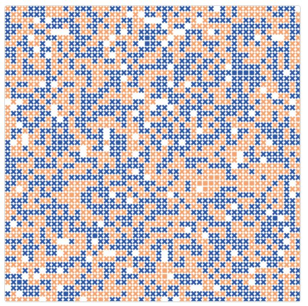

---
jupyter:
  jupytext:
    formats: ipynb,md
    text_representation:
      extension: .md
      format_name: markdown
      format_version: '1.2'
      jupytext_version: 1.6.0
  kernelspec:
    display_name: Python 3
    language: python
    name: python3
---

<!-- #region toc-hr-collapsed=false -->
 **41189 Modelling Assignment — Group 6**
 
 Topic: Measuring both the spread of Covid-19 and society’s response to preventative measures to the pandemic in Australia
 
 Group members:
 
 - Jordan Boulous
 - Alex Rebello
 - Cameron Solomon
 - Raymond Lam
 
<!-- #endregion -->

<!-- #region toc-hr-collapsed=false -->
#  Introduction
<!-- #endregion -->

## State the problem, why it is important/relevant to you and/or more broadly to society


This report will be focused on investigating the Covid-19 pandemic, government lockdown measures and society’s subsequent response. Covid-19 is an extremely infectious disease, transmitted through droplets of coughs, sneezes or exhales generated by an exposed person. Since the discovery of the new strain of Coronavirus, it has infected over 31.4 million people worldwide and taken the lives of over 966 thousand people. Australia has over 27 thousand confirmed cases with 850 fatalities (ABS, 2020). Although Australia has seen somewhat subsided Coronavirus cases in comparison to the world, government intervention has been swift and stringent. March 23rd, a landmark date for unprecedented government intervention with the Morrison administration announcing a ban on all non-essential services (M. Grattan, 2020) Society was brought to a halt, businesses were forced to shut and citizens were encouraged to adhere to stay-at-home orders (M. Grattan, 2020). Businesses that were deemed ‘essential’ also bore the brunt of the virus as most citizens were too scared to venture outside their homes. As businesses suspended trading many found themselves without a job, the unemployment rate rising to 6.8%, compared to 5.3% last year (ABS, 2020). With so many of the population out of work, there has also been a reduction in consumer spending, reduced by 20 per cent compared to the pre-pandemic norm (ABS, 2020). 

During the introduction of the government’s lockdown measures, citizens were mostly obedient, following stay-at-home orders which kept Coronavirus daily cases below 100 (ABS, 2020). However, Victorians have been subject to longer, more stringent lockdown measures as a result of a spike in Coronavirus cases. As seen on the 30th of July, Victoria recorded 723 new cases, the largest spike in Australia (ABS, 2020). Victorians have been subject to 2 months of Stage 4 Lockdown. have started to question the government’s lockdown measures (VIC GOV, 2020). Residents are citing the economic damage and the seeming eternal extensions of lockdown measures as reasons for their protests and riots (M. Paul, E. Clure, 2020). Over 300 Victorians have been caught protesting on September 5th, in a bid to end their Stage 4 lockdown (M. Paul, E. Clure, 2020). It is evident a small portion of society is dissatisfied with government intervention in regards to Covid 19, with residents complaining about the length and the strict enforcement of lockdown measures. 
Finally, this report aims to outline the eventual distribution of vaccines. A Covid-19 vaccine is hoped to prevent the virus from infecting the immune system. Vaccines are rumoured to be available to Australians within the next year, with the Morrison government securing over 84 million doses (S. Morrison, 2020). However, a study by Iposos surveyed over 20,000 adults to test their willingness to take a vaccine. In Australia, it was found that 1 in 10 adults would choose not to get vaccinated and only a 59% acceptance rate worldwide (Iposos, 2020). Iposos cites fear of side effects (56%) and doubt of effectiveness (29%) as reasons for declining the vaccine. 
 


<!-- #region toc-hr-collapsed=false -->
#  Context, background information, justification
<!-- #endregion -->

## Research and review literature, news, digital media, drivers and how the problem is being addressed by academia, industry, government, etc.


This article [5] gives a detailed description of COVID-19 and includes details about the original outbreak in Wuhan, forms of transmission, virion structure, physicochemical properties, replication, methods of diagnosis, treatment and precautions to prevent spread. The contents of the text are complete, clearly documented and use a variety of different resources to ensure accuracy. It also used very recent information that was available and despite being released in July, the article is still relevant in September. The authors study pharmacy, biomedical science and life science - so there may be some vested interest and bias due to the authors studying similar courses.
The article states that person-to-person transmission is likely for COVID-19 and is primarily spread through direct contact and droplets from a cough or sneeze. However, it was also found in stool samples, the gastrointestinal tract, saliva and urine. It also states that the SARS-CoV-2 (COVID-19) virion is spherical with a diameter of 80-120nm, contains a non-segmented, positive-sense RNA genome and contains numerous glycoproteins. Diagnosis and testing involves a swab and is often performed when a patient experiences fever, a sore throat, dry cough, dyspnea or they were in contact with a recent confirmed case.
Preventative measures include wearing face masks and other personal protective equipment (gloves), good hand hygiene, social distancing, isolation and quarantine. Rapid diagnosis, vaccines and therapeutics are critical in managing the COVID-19 pandemic.


This news page [6] from the Australian Government explains what COVID-19 is, symptoms and what to do if you have them, how it spreads, at risk demographics, preventative measures, how to get tested and the post-testing process. As it is written by the government, the information is complete, accurate and comes from a reliable source. The page and the pages for the individual states are constantly being updated as the situation progresses.
The page also examines the symptoms of COVID-19 as the previous article did, although this is in a more concise manner. It explains how the seriousness of COVID-19 can range from a mild illness to pneumonia and how some recover quicker than others. It lists the same symptoms as the article (fever, cough, shortness of breath, sore throat) as well as uncommon symptoms. If an individual experiences any of these symptoms, they are advised to get tested and contact the ‘Coronavirus Helpline’ which provides 24/7 support. It is important to isolate after getting tested. The demographics most at risk according to the page are travellers who have recently been overseas, those who have been in contact with someone with COVID-19, people in correctional facilities and people in group residential settings. If an individual has been overseas, they must isolate for 14 days and testing is important. Those most at risk of serious illness include older people and people with compromised immune systems, disabilities or chronic conditions. The page also covers the same preventative measures as the article as well as avoiding public gatherings, and give links to explain how each measure is effective. Many places of academia and businesses apply these preventative measures to prevent the spread of COVID-19. 
Various other government pages are available for each state and territory which discuss the different preventative measures and management of COVID-19. One of these include ‘Financial assistance for businesses’ on the NSW page as many businesses are struggling financially due to people isolating.


##  Identify the system + stakeholders. For this, you will need to construct a “rich picture” that captures the essential elements.


Agent Based Model- Stakeholders: The Government, Customers, Employees, Media, Trade Unions, Communities, Vendors 

Schelling’s Segregation Model- Stakeholders: The Government, Customers, Employees, Media, Trade Unions, Communities, Vendors 

Riot Models- Stakeholders: The Government, Customers, Employees, Media, Trade Unions, Communities, Vendors 

Each stakeholder affects each system in the same way:
- The Government- The models that we use will have to comply with government laws and regulations. 
- Customers- Models will be served to customers needs in order to prevent COVID 19.
- Employees- The employees that are hired to carry out the actions of the model play a pivotal role on the outcome of the model’s functionality. 
- Media- The media will play a role in promoting the different models and provide specific information on it. 
- Trade Unions- Trade Unions will provide a safe and happy work environment with the employees of the trade unions. 
- Communities- Communities will provide feedback to the models that are used to prevent COVID 19. 
- Vendors- Companies that construct models will purchase different materials and parts from vendors. 


## Identify current models or prevailing frames that are being used to address the problem


<!-- #region -->
Models are a way to simulate a population’s behavior. By understanding models, they can be used to assist with predictions, designs and actions (UML, 2013). Government leaders all over the world are utilizing hundreds of models in an effort to understand and inhibit the transmission of the Coronavirus (ABC, 2020). Although the specific relationship between Covid cases, riots and lockdown measures have not yet been thoroughly investigated, both government agencies and private businesses have made extensive records of Covid 19 cases. Currently, the Australian Government is using Compartmental SEIR models led by the Doherty Institute as a basis for important decisions (J. Janson, 2020). The Compartmental SEIR model uses compartments as a means to simplify the mathematical modelling of infectious diseases. SEIR refers to the different states the population can exist in; susceptible, exposed, infectious and recovered. As the compartmental model is represented by an exponential decay, meaning there is an asymptote at zero infected individuals (J. Janson, 2020). 


In an effort to prohibit the transmission of the Coronavirus, governments all over the world have issued varying levels of lockdown and stay-home measures. However, by enforcing these orders and saving lives, private businesses are facing hardships as customers are scarce and money is tight. As stated by PWC’s report “We estimate that over a year , a coronavirus pandemic could reduce Australia’s GDP by $34.2 billion”. PWC have used the Global Trade Analysis model (GTAM) which is “a multi-region global, multisector, computable general equilibrium model”. A similar approach was adopted by the Commonwealth Treasury during the SARS outbreak of 2002-03. The GTAM is a mathematical model that uses a “back casting exercise”, which analyses data from previous years or instances in order to model its current task. The GTAM uses a plethora of data in an attempt to cover as many aspects of the economy as possible. 


Currently, there are no specific models investigating the acceptance of vaccines. This is due to the mysterious nature of the Coronavirus and doubts surrounding the existence of a vaccine. There are however, numerous studies surrounding the acceptance of vaccines both before and during the Covid-19 pandemic. According to the Centre for Countering Digital Hate (CCDH), there has been a surge of activity from anti-vaccine groups with an estimated 7-8 million new members since 2019 (Lancet, 2020). There is also a growing number of Covid-19 disbelievers since the pandemic started, groups led by people with questionable credentials as mentioned in the article by L. Golman (2020). 


<!-- #endregion -->

## Discuss how prevailing models/frames are preventing the problem from being fully addressed or solved


<!-- #region -->
Current SEIR models are significantly preventing COVID 19 from being fully addressed and solved. SEIR models currently are overly pessimistic, such that they depict the worse effects that COVID 19 can have on individuals (Sun, 2020). By expressing these worse case scenarios depicts an inaccurate depiction of COVID 19 as currently not everyone is facing the worse off effects with many of them experiencing small to mild effects. Another issue that occurs from SEIR models is exponential decay occurs within these models. This negatively portrays the actual number of COVID 19 cases suggesting that COVID cases will never reach 0 cases. In reality this is incorrect because once a vaccine is developed there will be no COVID 19 cases, which is uncorrelated to the SEIR models exponential decay function. 


Big Data models also are other models that are preventing COVID 19 to be fully solved. Big Data Models have the main purpose of suggesting how many cases of COVID 19 per day or all together in a certain country or population. This doesn’t solve the issue of COVID 19 as it only shows the number of cases and does not depict ways in which the pandemic can be dealt with. Also Big Data Models also show an inaccurate number of COVID 19 cases as in many developing countries, several cases go unreported (Lau, 2020). This doesn’t provide a true addressment of the actual number of COVID 19 cases in these countries. This also has a strong negative effect on the analysis of this data as the data analysis will be inaccurate in terms of the characteristics of COVID 19 cases in different countries (Lau, 2020). 


<!-- #endregion -->

<!-- #region toc-hr-collapsed=false -->
#  Conceptual Models
<!-- #endregion -->

##  Based on your self-study of the supermarket of models, explain the three models that you have chosen to look at the problem


#### Agent Based Model:
Agent based models attempt to simulate the real world in a 1:1 ratio. This is done by simulating the actions and interactions of autonomous agents that can be individuals or collectives, while assessing and analysing their effects on the system as a whole. This behaviour is based on their relations with the other agents. 
Individual agents are characterised as a rational thinker, meaning that they behave as such to optimise their goals using heuristics. One way to interpret this is ecological rationality. This could involve an individual looking over a fence and copying their neighbour if they are doing a task better, or keep doing the same thing while occasionally trying something new. The basic idea is to imitate, exploit and explore. The decisions an individual makes propagates through a complex network of interactions and the surrounding environment.
To simulate the real-world and complex systems, agent based models simulate the actions and interactions of autonomous agents. These agents may observe their environment, adapt to it and learn new principles that alter their way of thinking. 

#### Schelling’s Segregation Model:
Schelling’s segregation model is an agent based model created by Thomas Schelling. Schelling wanted a reason as to why people of different races and incomes tend to segregate in most parts of the developed world. It explains how an individual will segregate based on the behaviour of the surrounding agents or neighbours.
Imagine a NxN checkerboard. Some people (represented by squares) receive a higher salary AP and the others have a lower salary BP where P represents an individual. If I belong to the former category AP and most of my neighbours also belong to AP and hence AP ≥ BP, then I decide to stay. However, if most of my neighbours belong to BP and AP < BP, then I will relocate so that AP ≥ BP.
Everyone uses this heuristic where someone decides to move or stay depending on the ratio of people who are alike. It should be noted that a micro-motive does not equal macro-behaviour in Schelling’s segregation model.

#### Riot Models (Granovetter Threshold Theory):
Granovetter’s riot model is utilised in order to measure an individual’s willingness to make a decision based on the decisions of those around them (the rioters). Each person has a threshold and if the number of rioters exceeds that threshold, the person joins in.
N individuals indexed by i have a riot threshold, T(i) ∈ (0, 1, …, N), i.e T(i) is contained in the set of all possible, real number thresholds including 0; T(i) ∈ {ℝ+0}. Initially, any individual with a riot threshold of zero, T(i)=0, joins the riot. R(t) equals the number of people rioting at time t. Individual i participates at time t if T(i) < R(t-1).
This model reveals the importance of the entire distribution of thresholds rather than just the mean. It also shows the difficulty of predicting social movements and which ones will be successful.
An application of this is a group of 5 people deciding whether to wear a mask. If 0 people are wearing it and everyone has a threshold of 1 or more, nothing happens and nobody wears a mask. However, if the threshold order is 0, 1, 1, 2, 2, everyone will end up wearing a mask because the person at the start takes the initiative to wear it.


##  Explain how each of the three models works (brief) and how it will be applied in your case.


#### Agent Based Model:
Agent based models are used to simulate the interactions between different agents, which may include individuals in a society, in order to monitor and analyse the behaviours of each autonomous agent based on their relations with other agents, also ensuring to comprehend their influence on the surrounding environment.
Using the agent based model, we can establish the rates of infection and recovery according to the selected solutions. Agent-based models can be used to predict outcomes for an array of different scenarios in the Covid-19 predicament, providing reliable calculated estimates of the deaths, recoveries and infections for different preventative measures. With the application of this model, we are able to track the virus’ impact on individual agents, with constant updates occurring in order to provide a reliable model with relevant data based to assist with the tracking of infection and recovery in the Covid-19 global crisis. This can accentuate the success or failure of different preventative measures since the simulations can be compared to determine the most and least effective methods to diminish the impact of the virus.


#### Schelling’s Segregation Model:
Schelling’s segregation model is used to simulate the way in which individuals naturally segregate based on their personally selected threshold of similarity in the agents surrounding them.
With the Schelling’s segregation model, we are able to witness the behaviours of different individuals in society during the Covid-19 pandemic, measuring their happiness and comfortability in regards to their neighbours’ willingness to accept vaccines or wear a protective face mask. Hence, we are able to witness the effects of emotional segregation in different communities according to different ‘similarity rates’, which are the percentage of people surrounding individuals that they wish to be using a preventative measure in order to be satisfied. This is useful in regards to the possible solutions to the Covid-19 pandemic since it can be used to predict the contentment of individuals in a society after a vaccine is released, providing insight into the amount of vaccinations that need to be produced in order to create a general sense of comfort.


#### Riot Model (Granovetter Threshold Theory):
Riot models, when taking into consideration the Granovetter threshold theory, are utilised in order to measure an individual’s willingness to make a decision based on the decisions made by people around them. Each individual has their own personal threshold, which when exceeded will result in them making a certain decision, mimicking the behaviours of those around them.
Through the use of riot models, with a specific focus on the Granovetter threshold theory, it has been made evident that we can effectively measure the threshold for different individuals to participate in accepting the vaccine and thus ‘joining the riot’. This is necessary information as it allows us to be able to recognise the number of willing participants based on the different thresholds in a society. Hence, this data can be utilised to predict the amount of vaccines that must be produced, and can also be used to predict the amount of people with specific thresholds required in order to flatten the curve representing the growth of Covid-19.  


##  Describe any data sources (real or hypothetical) that are needed to construct the three models. Use illustrative drawings and diagrams where possible

<!-- #region -->
#### Agent Based Model:
Agent based models take into consideration the number of degrees for each individual agent. This is necessary, as the degrees, or the connections, allow the model to measure the amount of interactions that each infected model may have. Also, the individual recovery rate is considered in the agent based model, with the average of 14 days being applied to agents after they have been recognised as infected. The following agent based models were generated using (Covid-19 Demonstration Model, 2020).

- Covid agent based model without lockdown being implemented as a preventative measure:


This model is simulating the spread of covid-19 in a group of 100,000 agents over 100 days, assuming that 100 people are initially infected. These individuals are said to have an average of 20 connections, with a 1.4% chance of spreading the virus to those agents. Also, the recovery rate is approximately 14 days after an individual is infected.


- Covid agent based model with an 85 day lockdown being implemented after 15 days of the virus being present in society:


This model keeps all the same characteristics as the prior model, except after 15 days, lockdown was forced upon society, which is said to reduce interactions by 90% and will last 85 days.


<!-- #endregion -->

<!-- #region -->
#### Schelling’s Segregation Model:
Using the segregation model provided by NetLogo (Wilensky, 1997), we are able to input our own similarity rate to measure the behaviours of individuals when they require X% of individuals around them to have been vaccinated or be willing to wear a mask in order to be satisfied.
- Segregation Model with 0% similarity rate (0% of neighbours must be vaccinated or wearing a mask as a preventative measure)


Individuals are not at all segregated


- Segregation Model with 75% similarity rate (75% of neighbours must be vaccinated or wearing a mask as a preventative measure)


Individuals are almost entirely segregated.


<!-- #endregion -->

<!-- #region -->
#### Riot Model (Granovetter Threshold Theory):
In order to use the riot model effectively, we must estimate the thresholds of individuals in a society. Assuming that the ‘riot’ action is accepting a vaccination as a preventative measure to Covid-19, then there are different hypothetical scenarios which could occur:
- If a sample of 100 individuals is taken and the lowest threshold of an individual T(i) = 1, then nobody will take the vaccine. 
- In order to correct this, there must be an individual with T(i) = 0, which is likely for desperate individuals or individuals with a strong incentive to take the vaccine. Hence, for each individual with T(i) = 0, the number of people rioting R(t) will increase by 1. 
- Then, for each other individual, the following formula, T(i) >= R(t) is applied. If true, then they will accept the vaccine and R(t) will increase. 
- Eventually, either everyone will accept the vaccine, or those with extremely high thresholds will never accept the vaccine.

Hence, in order to apply this model, a sample of the population would need to provide their own personal threshold which would result in them accepting the vaccine as a preventative measure to the Covid-19 pandemic.


Similarly, the 'riot' action could be identified as wearing a mask. It is safe to assume that the average sample mean of a threshold for wearing a mask would be lower than accepting a vaccine. Hence, the same formula would be applied to understand how many members of the sample population (size 100) would be willing to wear a mask as a preventative measure to the Covid-19 pandemic.
<!-- #endregion -->

*The above scenarios for each of the chosen models will be explored in greater detail in Section 5.1*

<!-- #region toc-hr-collapsed=false -->
# Implementation
<!-- #endregion -->

## Describe the mathematical and/or statistical implementation of your three models. This should be done using Python code.


#### Agent Based Modelling


(Alto, 2020)

```python
from mesa import Agent, Model
from mesa.time import RandomActivation
from mesa.datacollection import DataCollector
from mesa.space import MultiGrid

from mesa.batchrunner import BatchRunner

import random
import numpy as np
import sys
import matplotlib.pyplot as plt
import random
```

```python
class Agent(Agent):
    """ An agent with fixed initial wealth."""
    def __init__(self, unique_id, model):
        super().__init__(unique_id, model)
        self.infected = 0
        
    def spread_news(self):
        if self.infected == 0:
            return
        neighbors = self.model.grid.get_neighbors(self.pos,moore = True, include_center=True)
        neig_agents = [a for n in neighbors  for a in self.model.grid.get_cell_list_contents(n.pos)]
        for a in neig_agents:
            if random.random()<0.014:
                a.infected = 1
    
    def move(self):
        possible_steps = self.model.grid.get_neighborhood(
            self.pos,
            moore=True,
            include_center=False)
        new_position = self.random.choice(possible_steps)
        self.model.grid.move_agent(self, new_position)
        
    def step(self):
        self.move()
        self.spread_news()
```

```python
#let's define a function which is able to count, at each step, how 
#many agents are aware of the product

def compute_informed(model):
    return  sum([1 for a in model.schedule.agents if a.infected == 1])

class News_Model(Model):
    def __init__(self, N, width, height):
        self.num_agents = N
        self.grid = MultiGrid(width, height, True)
        self.schedule = RandomActivation(self)
        self.running = True
        
# Create agents
        for i in range(self.num_agents):
            a = Agent(i, self)
            self.schedule.add(a)
            x = self.random.randrange(self.grid.width)
            y = self.random.randrange(self.grid.height)
            self.grid.place_agent(a, (x, y))
            l = [1,2,3,4,5]
            if i in l: #only one agent is informed
                a.infected = 1
                
        self.datacollector = DataCollector(
            model_reporters = {"Tot informed": compute_informed},
            agent_reporters={"Infected": "infected"})
        
    def step(self):
        self.datacollector.collect(self)
        self.schedule.step()
```

```python
model = News_Model(100, 50, 50)
for i in range(100):
    model.step()
out = model.datacollector.get_agent_vars_dataframe().groupby('Step').sum()
out
```

```python
out.plot()
```

#### Schelling’s Segregation Model


(Palmer, 2018)

```python
%matplotlib inline
```

```python
import matplotlib.pyplot as plt
import numpy as np
import itertools
import copy
import matplotlib.gridspec as gridspec
from matplotlib import colors
import seaborn as sns
import networkx as nx
import tqdm
plt.style.use('seaborn-whitegrid')
sns.set_palette('PuOr')
```

```python
class Agent:
    def __init__(self, x, y, kind, preference, world):
        self.x = x
        self.y = y
        self.kind = kind
        self.preference = preference
        self.world = world
    
    def know_neighbours(self):
        self.neighbours = [self.world.coords[x % self.world.size, y % self.world.size]
                           for x, y in itertools.product(range(self.x-1, self.x+2),
                                                         range(self.y-1, self.y+2))]
    
    def swap(self, partner):
        self.kind, partner.kind = partner.kind, self.kind
    
    def happiness(self):
        neighbour_kinds = [n.kind for n in self.neighbours]
        numsame = neighbour_kinds.count(self.kind)
        numvacant = neighbour_kinds.count(0)
        if numvacant == 8:
            if self.vacant():
                return 1.0
            return 0.0
        return (numsame - 1) / (8 - numvacant)
    
    def dissatisfied(self):
        return self.happiness() < self.preference
    
    def vacant(self):
        return self.kind == 0
```

```python
class World:
    def __init__(self, size, kinds, probs, preference):
        self.size = size
        self.preference = preference
        self.coords = self.populate_world(kinds, probs, preference)
        [a.know_neighbours() for row in self.coords for a in row]
        self.num_dissatisfied = size ** 2
        self.num_vacant = sum([a.vacant() for row in self.coords for a in row])
    
    def populate_world(self, kinds, probs, preference):
        return np.array([[Agent(x, y, np.random.choice(kinds, p=probs), preference, self) for y in range(self.size)] for x in range(self.size)])
    
    def atlas(self):
        return np.array([[a.kind for a in row] for row in self.coords])
    
    def happiness_distribution(self):
        return [a.happiness() for row in self.coords for a in row if not a.vacant()]
    
    def advance_turn(self):
        dissatisfied = []
        vacant = []
        for row in self.coords:
            for a in row:
                if a.vacant():
                    vacant.append(a)
                elif a.dissatisfied():
                    dissatisfied.append(a)
        self.num_dissatisfied = len(dissatisfied)
        np.random.shuffle(dissatisfied)
        np.random.shuffle(vacant)
        num_swap = min(self.num_dissatisfied, self.num_vacant)
        for indx in range(num_swap):
            dissatisfied[indx].swap(vacant[indx])
    
    def play(self, threshold=0.01):
        while self.num_dissatisfied / (self.size ** 2) > threshold:
            self.advance_turn()
```

```python
class WorldArchiving(World):
    def __init__(self, size, kinds, probs, preference):
        super(WorldArchiving, self).__init__(size, kinds, probs, preference)
        self.archived_atlases = []
    
    def archive(self):
        self.archived_atlases.append(copy.deepcopy(self.atlas()))

    def play(self, threshold=0.01):
        self.archive()
        while self.num_dissatisfied / (self.size ** 2) > threshold:
            self.advance_turn()
            self.archive()
```

```python
def plot_atlas(w, turn):
    num_turns = len(w.archived_atlases)
    cmap = colors.ListedColormap(['white', '#FFCC1A', '#630081'])
    fig, ax = plt.subplots(1, figsize=(11, 11))
    ax.pcolor(w.archived_atlases[turn], cmap=cmap)
    ax.set_xticks([])
    ax.set_yticks([])
    plt.tight_layout()
    fig.savefig('atlas_' + str(turn))
```

```python
def number_connected_components(w):
    temp = np.matrix(copy.deepcopy(w.atlas()))
    nodes = ['(' + str(x) + ', ' + str(y) + ')' for x in range(w.size) for y in range(w.size) if temp[x, y] != 0]
    G = nx.Graph()
    G.add_nodes_from(nodes)
    for x in range(w.size):
        for y in range(w.size):
            if temp[(x+1) % w.size, y] != 0 and temp[x, y] != 0:
                if temp[(x+1) % w.size, y] == temp[x, y]:
                    G.add_edge('(' + str(x) + ', ' + str(y) + ')', '(' + str((x+1) % w.size) + ', ' + str(y) + ')')
            if temp[x, (y+1) % w.size] != 0 and temp[x, y] != 0:
                if temp[x, (y+1) % w.size] == temp[x, y]:
                    G.add_edge('(' + str(x) + ', ' + str(y) + ')', '(' + str(x) + ', ' + str((y+1) % w.size) + ')')
    return nx.number_connected_components(G)
```

```python
num_trials = 10
```

```python
np.random.seed(0)
worlds = {str(round(pref, 4)): [World(40, [0, 1, 2], [0.1, 0.45, 0.45], pref) for trial in range(num_trials)] for pref in [i*0.01 for i in range(76)]}
```

```python
for k, trial in tqdm.tqdm(list(itertools.product(worlds, range(num_trials)))):
    worlds[k][trial].play(threshold=0.00005)
```

```python
nrows = 3
ncols = 4
cmap = colors.ListedColormap(['white', '#FFCC1A', '#630081'])
fig, axarr = plt.subplots(nrows=nrows, ncols=ncols, figsize=(22, 18))
for i, k in enumerate(['0.2', '0.25', '0.3', '0.35', '0.4', '0.45', '0.5', '0.55', '0.6', '0.65', '0.7', '0.75',]):
    axarr[i // ncols, i % ncols].pcolor(worlds[k][0].atlas(), cmap=cmap)
    axarr[i // ncols, i % ncols].set_xticks([])
    axarr[i // ncols, i % ncols].set_yticks([])
    axarr[i // ncols, i % ncols].set_title('Preference = ' + str(k), fontsize=34)
plt.tight_layout()
fig.savefig('increase_preference')
```

#### Riot Model (Granovetter Threshold Theory)


(G. Rossetti et al., n.d.)

```python
import networkx as nx
import ndlib.models.ModelConfig as mc
import ndlib.models.epidemics as ep

# Network topology
g = nx.erdos_renyi_graph(1000, 0.1)

# Model selection
model = ep.ThresholdModel(g)

# Model Configuration
config = mc.Configuration()
config.add_model_parameter('fraction_infected', 0.1)

# Setting node parameters
threshold = 0.25
for i in g.nodes():
    config.add_node_configuration("threshold", i, threshold)

model.set_initial_status(config)

# Simulation execution
iterations = model.iteration_bunch(200)
```

# Scenario analysis, sensitivity + uncertainty evaluation


## Establish baseline parameter sets and or configuration for output scenarios


With the evolving and complex nature of the predicament caused by the Covid-19 pandemic, the way in which people interact has drastically altered. This has proven to be a major detriment to many businesses as the changing nature of work has minimised productivity, with people insisting on remaining socially distant. However, with the implementation of the previously discussed models, we are able to estimate how the interaction between individuals can be increased through the form of a lockdown, the wearing of face masks and the release of a vaccine


#### Agent Based Modelling


The agent based model is implemented to the Covid-19 pandemic in order to measure the impact of the lockdown as a preventative measure, deducing whether or not it is successful, and in what predicament would it be most efficient in diminishing the spread of the virus. The scenarios are generated with various inputs (Covid-19 Demonstration Model, 2020) in order to depict the potential number of infected, recovered and deceased agents under various scenarios. The models all take the assumption that the fatality rate of the virus is approximately 2.78% (COVID-19 CORONAVIRUS PANDEMIC, 2020). 


- Covid agent based model without lockdown being implemented as a preventative measure:


This agent based model acts as a visualisation of what would occur if the preventative measure of a lockdown was not implemented into a society of 100,000 agents over the span of 100 days, assuming that 100 agents were initially infected. Also, the model assumes that the average recovery time of an infected individual would be 14 days after they contract the virus. The model also assumes that each agent (node) in the network has 20 connections (degrees). Since these interactions may be as simple as walking past somebody on the street, the chance of an infected individual transmitting the disease is 0.014, or a 1.4% chance. This configuration is maintained throughout the following scenarios, with the only difference being the implementation of lockdowns of varying durations at different moments of the 100 day period. Taking the estimated fatality rate as 2.78%, we can assume that in this scenario that after the 100 days, that 2,678 of the 96,340 agents who contracted the virus would have died. Hence, with no lockdown, it can be assumed that 2,678 of every 100,000 people would die from the virus after 100 days of its existence in society.


- Covid agent based model with a 30 day lockdown being implemented after 15 days of the virus being present in society:


This model represents the introduction of a lockdown which reduces the amount of connections each individual interacts with by 90%. This lockdown has a duration of 30 days and is implemented 15 days after the virus is initially recognised in society. As seen in the graph, the lockdown was highly successful during its duration. However, after the 30 days was completed, the reopening of society led to a severe surge of cases. Ultimately, by the 100th day, 10,249 agents were still infected with the virus, which is a significant increase from the first scenario with no lockdown, which had 0 infected agents by the end of the 100 day period. Also, out of the 85,353 agents, using the estimated fatality rate, it can be assumed that 2,372 individuals would have died from the virus, with the potential to increase with the currently infected agents. Hence, whilst this lockdown has slightly reduced the amount of deaths after the 100 day period, it has prolonged the existence of the virus in society, perhaps proving more detrimental in the long run.


- Covid agent based model with a 50 day lockdown being implemented after 30 days of the virus being present in society:


This model sees the implementation of a lockdown with a 50 day duration after 30 days of the virus being recognised in the society. The graph represents the success of the lockdown as the curve depicting the rate of infection abruptly begins to decrease with the lockdown being introduced in the society. Unlike the previous scenario, the lockdown's effect is continued even after its completion on day 80, with minimal new cases arising after the lockdown ends. Whilst there are still 38 infected agents at the 100th day, the amount of agents who were never infected at any stage of the 100 day period is significantly larger than the prior scenarios. Using the estimated fatality rate of 2.78%, it can be assumed that about 1,384 of the 49,799 closed cases had died. However, whilst this is still a large number, it is significantly better than the prior scenarios.


- Covid agent based model with an 85 day lockdown being implemented after 15 days of the virus being present in society:


With this final scenario, a lockdown with a duration of 85 days is introduced into society after 15 days of the virus being present in society. Due to the severe nature of this preventative measure, the number of agents who never contracted the virus is extremely high at 96,633. Hence, out of the 3,367 closed cases, using the 2.78% fatality rate, we can estimate that there were 93 deaths in this scenario. Whilst this scenario would hypothetically be the most effective measure in terms of reducing the amount of infected agents, it can be perceived as unreasonable. This is due to the fact that reducing 90% of interactions for 85 days may have a detrimental influence on the mental wellbeing of the individuals in society. Hence, whilst the model is successful in displaying the statistical information regarding the infection of the agents in this scenario, it does not account for the wellbeing of the agents, as the 85 day lockdown may be perceived as irrational and improbable.


#### Schelling’s Segregation Model


Through the implementation of Schelling's Segregation Model, we are able to see the extent to which individuals may go to in order to be comfortable with the neighbours surrounding them in regards to their acceptance of vaccines and face masks as a preventative measure to the Covid-19 pandemic issue. Whilst the segregation models do not track the physical locations of the individuals since people would not be willing to move houses in order to be satisfied with their neighbours' measures to prevent the virus, they are useful to recognise the structure that a society would need to take in order for all members to be completely satisfied. The following scenarios are generated using the NetLogo segregation model (Wilensky, 1997).

<!-- #region -->
- Segregation Model with 0% similarity rate (0% of neighbours must be vaccinated or wearing a mask as a preventative measure)


In this model, there are 2,467 agents who each require 0% similarity in order to be happy. Hence, there is no evident sign of segregation and there are 0 unhappy individuals in the society.


- Segregation Model with 25% similarity rate (25% of neighbours must be vaccinated or wearing a mask as a preventative measure)


In this model of 2,484 agents, individuals are still fairly mixed with non-similar agents, but it is noticeable that they are slightly more segregated. However, there are still 0 individuals who are unhappy with their position since their expectations to have 25% of similar individuals around them are satisfied.


- Segregation Model with 50% similarity rate (50% of neighbours must be vaccinated or wearing a mask as a preventative measure)


Individuals are heavily, but not entirely, segregated in this model of 2,483 agents. It can be assumed that this is the most likely scenario in the vast majority of societies, with individuals hoping to have half of their neighbours using one of the 2 referenced preventative measures for them to feel safe. In the model, there are still 0 unhappy individuals. 


- Segregation Model with 75% similarity rate (75% of neighbours must be vaccinated or wearing a mask as a preventative measure)


In this model of 2,501 agents, individuals are almost entirely segregated. Whilst this scenario is unlikely in most societies, since it is impractical to think that 75% of people will have the same response to the Covid-19 pandemic, this model proves that it is still possible for there to be 0 unhappy individuals. However, it is made evident that this predicament would take a significantly longer time than the previous scenarios since it is vastly more difficult to find similar agents with these potentially unrealistic expectations.


- Segregation Model with 100% similarity rate (100% of neighbours must be vaccinated or wearing a mask as a preventative measure)

 

This model consists of 2,466 agents where the impossible 100% similarity is expected from the individuals. Whilst the model does not have a definitive result, it runs at a similarity rate of about 50% and the number of unhappy individuals does not seem to go lower than 2,439. Hence, this model only exists to present how implausible it would be for individuals to have a rate of 100% similarity wanted.
*Note: The squares with an "x" represent an unhappy agent.*
<!-- #endregion -->

#### Riot Model (Granovetter Threshold Theory)


When implementing the riot model into the chosen scenario, which relates to society's tolerance of accepting a vaccine or wearing a mask as an appropriate preventative measure to the Covid-19 pandemic, we consider the Granovetter Threshold Theory in order to recognise whether the majority or the minority of the community will 'riot' or accept the action in question. This model, when applied to a sample population, can be used to statistically estimate the overall success of such optional measures as vaccines and mask-wearing through the consideration of how many members of the society will accept the course of action in order to diminish the influence of the virus. 


Consider we had a sample population of 10 individuals with the following thresholds {0,0,3,4,5,6,7,8,9,10}

In this case, the two individuals with a threshold of 0 would immediately 'riot', whether that action is accepting a vaccine or wearing a mask in public environments. However, due to the fact that the lowest threshold after the 2 initial rioters is 3, they choose not to riot (since 3>2). So the total number of rioters in this scenario would be 2, which would essentially render the preventative measure useless since 80% of the population is still entirely exposed to the virus.


Now, consider we had a sample population of 10 individuals with the following thresholds {0,0,2,3,4,5,6,7,8,9}

Similarly to the previous predicament, the first two immediately 'riot'. However, this time the next individual has a threshold of 2. Since 2<=2, the individual will choose to riot, incrementing the amount of rioters to 3. This continues to the next individual, and the next, until all individuals in the sample population have begun 'rioting'. Hence, in this scenario, 100% of the society has accepted the chosen preventative measure, significantly decreasing the probability of survival for the virus in that closed community. 


Again, consider we had a sample population of 10 individuals with the following thresholds {1,2,3,4,5,6,7,8,9,10}

This time, due to the fact that the individual with the lowest threshold has a threshold of 1, nobody in this sample population will ever accept the preventative measure, since nobody is willing to initially choose to riot with a threshold of 0. Hence, the number of rioters will always be 0 in the scenario. Hence, the likelihood of eradicating the virus in this society is essentially futile since 0% of the population is willing to accept a preventative measure.


## Perform a basic sensitivity analysis, i.e., identify with parameters are most sensitive/insensitive for the outputs

```python

```

```python

```

```python

```

<!-- #region toc-hr-collapsed=false -->
# Proposed solutions
<!-- #endregion -->

## Discuss potential portfolio of solutions based on your previous analysis


As can be seen above, the models of Agent Based Models, Schelling’s Segregation Model and Riot Model have been investigated in order to stop the spread of COVID-19. After thorough analysis of each model it has been decided that Agent Based models are the most useful in preventing the spread of COVID-19 in comparison to other models. This is because agent based models show how successful a lockdown would be if every individual reduces their interactions. 


Many model thinking can be used in order to propose solutions to improve the state of the systems that have been used in order to prevent COVID-19. In terms of agent based models, one of the main disadvantages of it is the performance speed of these models reduces often. One way of improving these agent based models’ performance speed is by adapting a time extension to it. This will improve the solution as it will portray to the scientist’s the solution at a quicker rate. Another limitation of Agent based models is it is reliant that all the individuals will reduce their interactions, which means the solution will not work with everyone as not every individual will follow lockdown rules. One way to improve this is by excluding the people who don’t follow lockdown rules as this will show the real success of the lockdown and improve the data that is shown from agent based models. 


By using many model thinking, Schelling’s Segregation model can be improved to portray a better solution of preventing the spread of COVID-19. One of the current issues with Segregation models is that running the model with the same preference configuration can potentially lead to vastly different outputs, hence these models can be slightly unreliable. One of the ways of resolving this issue is by conducting several tests before the Segregation model is completed and synthesising the test results to get a more accurate final result. Another thing that can be done to Segregation Models is changing the required similarity rates of these models, as Segregation Models fail to account for people changing their behaviour over time. Segregation Models showing people’s changing behaviours will delineate a more accurate solution in order to prevent the spread of COVID-19. Another disadvantage is that Segregation Models vary from city-to-city. People in one city may segregate more or less when taking into account multiple factors such as wealth, race, if people who have COVID-19 are nearby and proximity of houses.


With respect to many model thinking, Granovetter’s Riot Model can be used to see if people will accept a new vaccine as a preventative measure for COVID-19. The main disadvantage with Granovetter’s Riot Model is that a small sample of the public must be willing to test out the vaccine as soon as it is released. If everyone has a threshold greater or equal than 1, no one will try the vaccine. By getting a willing volunteer to test, we can apply the Riot Model successfully and demonstrate how quickly the vaccine will be distributed globally. In a way similar to Schelling’s Segregation Model, Granovetter’s Riot Model does not account for people changing their behaviour over time. A person’s threshold may go up suddenly for a number of reasons, such as a recently found side effect with a vaccine or a family member advises them to not get it. This is important as it means the person may never take the vaccine. Accounting for this changing behaviour and increasing people’s confidence may make Riot Models more suitable, but this is difficult to do so this model is not suitable for this scenario.

<!-- #region toc-hr-collapsed=false -->
# Reflection on group + individual approach to assignment
<!-- #endregion -->

## Each student should discuss their experiences about working on the project. The document should be no more than 1000 words per group member. It should discuss following key aspects:

i) Your contribution in the project

ii) Other group members’ contributions

iii) What positives do you take from this project? What did you learn from this project?

iv) What challenges did you face in this project and how you overcame those?

v) If you are faced with dealing with a real-world problem and need to do some modelling, how would you determine which modelling approach to take. Justify your response.	


### Jordan Boulous reflection


i) The sections that I contributed towards with this group reported consisted of writing the responses to 3.2, 3.3 and 5.1, as well as assisting with the finding and implementation of the code for section 4. I was also designated as the group member to implement all of our work onto Jupyter Notebook and push the commits to our GitHub repository.  When reflecting on the work that I contributed towards the project, I am able to acknowledge the difficulties that I experienced during the duration of the task, especially with the platforms that I had previously been entirely unfamiliar with that I had to use in order to complete the report. However, I am also proud of my overall contribution due to the hours that I put into researching and completing my sections to what I believe to be at a high quality.

ii) In regards to the contributions of the other group members, I believe that they each put considerable effort into their given tasks and were ultimately successful in collaborating with each other and myself regardless of the limitations due to the at-home learning environment as a result of the Covid-19 pandemic. Each of the members evidently dedicated significant amounts of time towards the task which was made evident through their constant updates of their sections, as well as constantly asking questions on how they can better their sections.

iii) The most apparent positive which I can take from this project is the notion of many model thinking. The fact that multiple models can be applied to one problem to accentuate the multiple facets of the issue, resulting in more varied and successful solutions is a concept that will prove to be vital in essentially all aspects of business. Another major benefit of this project is getting used to GitHub, not only as a tool to create repositories, but also to find existing working models which I can adapt to fit practically any desired task. 

iv) Upon reflecting on the group’s approach to the report, it is made evident that we were forced to deal with multiple issues, mostly arising as a result of our inexperience with Python, GitHub and Jupyter Notebook. The first major issue came with installing the necessary extensions to use Jupyter Notebook in addition to GitHub. Initially, Alex attempted to do this, although after running into a few difficulties with the process, I attempted to do so and after a bit of research on how to do so, I was able to successfully install the required extensions. It was from here that I was able to learn how to push changes to the GitHub repository which allowed us to complete the report in the manner that was required. Another significant problem arose when completing the implementation section of the report, which we found difficult primarily due to the fact that none of us has had any experience with Python. However, with the help of Juan, we were able to understand what exactly was required of us, and how we were simply meant to find existing code for working models and adapt that code to fit our problem, as opposed to writing the models from scratch. This made the section a lot easier to follow and we were able to find appropriate code for our selected problem.

v) When deciding on the models to use for a selected problem, you must consider the involved agents before you can select a model. For example, if the model relates to understanding a person’s, or group of people’s, behavioural characteristics, than it would be necessary to implement a model which explains why people make certain decisions, such as a signalling model or a networking model to understand how information is exchanged between the agents and influences their decision making abilities. Similarly, if the focus of the problem is related to statistics and the analysis of data, then distribution models would be considered. This is made evident through our selection of models since we established that the preventative measures to the Covid-19 pandemic have different effects on different people, and in order to measure their satisfaction or tolerance of a certain solution to the virus, we implemented the segregation and riot models, to understand how they would respond to the measures. Also, the agent based model was implemented in order to measure the success of a lockdown, which is suitable since it is a 1-1 model of reality, which makes it appropriate for this specific problem.


### Alex Rebello reflection


i) My contribution to the group project was I worked on the Part 2.2, 3.1, 4 and Part 6 of the assignment. These tasks included identifying the systems and the stakeholders, addressing how prevailing models are preventing the problem to be resolved, describing the models using Python code and a portfolio of the solutions. 

ii) In terms of other members' contributions, everyone worked to their full potential and made sure everything was done to an exceptional standard by maintaining the assignment was completed on time. Raymond completed Part 1.1 (Introduction), 2.3 (Current Models that are being used to prevent COVID 19) and 5.2 (Sensitivity Analysis) of the assignment. Cameron completed Part 2.1 (literature review on COVID 19) and helped me with Part 4 (describing the models using Python code) and 6 of the (assignment portfolio of the solutions). Jordan completed Part 3.2 (Explanation of how each model works), 3.3 (Data sources required to construct these models) and 5.1 of the assignment (Establishing baseline parameter sets and configuration for output scenario). 

iii) I take many positives from the project. One of the main positives that I take is it has enhanced my understanding of models and has made me more interested in the models that I have learnt in the project. Also by completing the assignment I was able to meet people who I had never knew before, which is good as it has expanded my network and helped me learn new things.
One of the main things that I learnt from the project is the importance of models in society. This can be seen as models can help solve the most complex of issues in society. This can be depicted as for example agent based models can be used to prevent the spread of COVID 19, one of the biggest issues that our world is trying to resolve currently. I have learnt from the project that models can be used to explain and make predictions about many things in the world. By completing the assignment I was able to further expand my knowledge of Agent Based Models, Schelling’s Segregation Model and Riot Models. Before this assignment I had a decent understanding of these models because it was explained well in the workshops. Now I have a much greater understanding because while completing the assignment I have done additional and thorough research regarding these models. Also by learning about these models is significant in my desired future profession. My desired profession is to become a Data Analyst, in which Agent based models are used, so this will be advantageous as I already have a fundamental understanding of these models. 

iv) One of the main challenges that I faced in this project was originally understanding Python code. It was difficult to understand Python code because I have had no experience of Python code in the past as I have only had experience in Java code and C++ code.  There were two ways in how I overcame the challenge of originally understanding Python code. One of the ways was approaching Juan and asking him for help. My group and I asked Juan for help in understanding Python code and he responded by attaching articles of Python code and its link to different models such as Agent based models and Schelling’s Segregation Model. This was very beneficial for me as it gave me ideas of code to use when explaining the different models. Another way in which I overcame the challenge of Python Code is by doing extensive research and watching YouTube videos on Python code explaining the fundamentals of this code.
Another challenge that was faced in this project was communication was difficult originally because due to the COVID 19 protocols our subject was not open on Campus. This problem was resolved because after I joined Group 6, Jordan Boulous created a Facebook Messenger group chat, which included myself, Cameron Solomon and Raymond Lam. This was beneficial as we now inform each other of any difficulties that we are facing or any questions about the assignment and someone else in the group will answer the question. This has helped our group submit an adequate assignment as well as making sure that the assignment was completed on time. 

v) If I was faced with a real world problem and needed to do some modelling I would determine the situation and the characteristics comprising the real world problem.
The most important thing is gaining as much data as possible about the specific real world problem. Once the data is gained it needs to be understood whether the data can be broken down efficiently into graphs. If this can be expressed well in graphical representation, then Network models should be preferred over other models.
Another characteristic that I will use in order to determine which modelling approach to use is how many different groups there are. For example if the real world problem was a virus, one group would be the virus with the other being the virus. If there were only two groups, then I would use the Colonel Blotto Game, whereas if there were multiple groups then I would use other models such as agent based models. 


### Cameron Solomon reflection


i)


### Raymond Lam reflection


i) My contribution to this assignment consists of parts, 1.1, 2.3 and 5.2. I believe my contributions to this assignment have reflected my full potential however, I feel I could have finished my contributions earlier and relieved stress from my other group members. I struggled to juggle my assignments and exams this semester and it is something I wish to work on throughout my time at university. 

ii) I believe my other group members have done an amazing job completing their respective sections of the task and have done it in a timely manner which allowed us, as a group, to look through and edit our assignment before it was due. However, with the pandemic and our current learning situations it made it somewhat difficult to schedule meetings with each other and our tutor. Our group was able to get together to solve a problem, although we had our own designated parts for the assignment, I found that we were able to solve issues an individual was having together.  I believe this expedited our  Overall I believe our group has completed this assignment to the best of our ability and I am happy with the final report we have produced. 

iii) This project has taught me to work together to solve problems, although I’ve completed group projects before it was usually extremely segregated and each person was focused on their own problems. However, with this task my teammates were extremely collaborative and worked through issues together. Also, the idea of many-model thinking, was solidified through this assignment. Although we had learnt about this concept in workshops, we were not able to experience it and fully immerse ourselves in this way of thinking. This project has allowed us to become many-model thinkers, which I believe will make us smarter citizens of the world. Finally, the use of GitHub and JupyterLab, at the start of this assignment our group was quite intimidated by these new platforms however as we explored its features and inner workings we have all become familiar with these popular platforms.

iv) Our group had many issues with Python and the implementation of our models into Jupyterlab. We worked together to solve small issues however with larder issues we had to reach out to Juan. As we were all new to Python and JupyterLab, we were unable to diagnose our code or read errors. Although with our research and the help of Juan we were able to work through these issues and come out with functional models. We also had issues communicating and setting meetings in the early-stages of this project. However, Jordan was able to overcome these issues by creating a group chat. This group chat allowed our group to stay in constant communication and update each other about our assignment. This chat also allowed us to set and attend meetings. Although our group had trouble setting an appropriate time to meet, we were able to overcome this by going through each day until we found a time in which we were all available. Finally, this chat allowed us to stay accountable and reach out to each other to ensure the task would be completed in a timely manner, allowing for final edits and formats. 

v) When selecting a model, there must be a succinct understanding of the goal, inputs and expected outputs. The aim of the model, depending on the situation different models are to be utilized for different purposes. It would be impossible to predict housing prices with Schelling’s Segregation Model, rather Markov models would be more appropriate. Similarly, the types of inputs and expected outputs of the model need to be considered. For numerical data types, distribution models would better suit the situation as they usually output graphs which may be closer to the desired output type. As shown in this report, measuring the rate of infection and overall satisfaction of government intervention regarding Covid-19, a combination of riot, agent-based and Schelling Segregation model are used. Finally, one must realise that a combination of models is most effective, in contrast to a single model. 


# References


[1] - Alto, V. (2020). ‘Understanding Agent Based Model: An Implementation with Python’, Medium.     https://medium.com/dataseries/understanding-agent-based-model-ae1941f7c9db

[2] - Archana, C., Pavan, J. & Satish, S. (2020). ‘COVID 19: Outbreak, Structure, and Current Therapeutic Strategies.’, Sakun Publishing House, vol. 11, issue 7, pp. 6825-6835. http://web.b.ebscohost.com.ezproxy.lib.uts.edu.au/ehost/pdfviewer/pdfviewer?vid=1&sid=5681bd2d-ac79-472a-8acc-63536f582b70%40sessionmgr101

[3] - Australian Bureau of Statistics. (2020). ‘Employment and Unemployment Statistics’, ABS. https://www.abs.gov.au/statistics/labour/employment-and-unemployment/labour-force-australia/latest-release

[4] - Australian Bureau of Statistics. (2020). ‘People and Communities, Household impacts of Covid-19 Survey’, ABS. https://www.abs.gov.au/statistics/people/people-and-communities/household-impacts-covid-19-survey/latest-release

[5] - Australian Government. (2020). ‘How does immunisation work?’, Department of Health. https://www.health.gov.au/health-topics/immunisation/about-immunisation/how-does-immunisation-work#:~:text=Vaccines%20strengthen%20your%20immune%20system&text=Vaccines%20use%20dead%20or%20severely,protect%20you%20against%20future%20infection

[6] - Australian Government. (2020). ‘What you need to know about coronavirus (COVID-19)’, Department of Health. https://www.health.gov.au/news/health-alerts/novel-coronavirus-2019-ncov-health-alert/what-you-need-to-know-about-coronavirus-covid-19

[7] - Burki, T. (2020). ‘The online anti-vaccine movement in the age of COVID-19’, THE LANCET, vol. 2, issue 10, E504-E505. https://www.thelancet.com/journals/landig/article/PIIS2589-7500(20)30227-2/fulltext

[8] - Carter, R., Chou, E. & Singgih, P. (2020). ‘Tensions flare at LA Civic Center over coronavirus stay-home orders’, Daily News. https://www.dailynews.com/2020/05/01/la-city-hall-protestors-plan-to-decry-coronavirus-stay-
home-order/

[9] - Clure, E., Paul, M. & ABC Staff. (2020). ‘Anti-lockdown coronavirus protesters arrested in Melbourne, solidarity rallies held across Australia’, ABC. https://www.abc.net.au/news/2020-09-05/melbourne-coronavirus-restrictions-lockdown-protests-police/12633164

[10] - Crabme Pty Ltd. (2020). ‘COVID-19 Demonstration Model’, Retrieved 20 September 2020, from http://covidagentmodel.com/

[11] - Fields, C., Koehler, B. & Timmes, F. (2015-). ‘MESA-Web’, Retrieved from http://mesa-web.asu.edu

[12] - G. Rossetti, L. Milli, S. Rinzivillo, A. Sirbu, D. Pedreschi, F. Giannotti. "NDlib: Studying Network Diffusion Dynamics", IEEE International Conference on Data Science and Advanced Analytics, DSAA. 2017.

[13] - Grattan, M. & ABC Staff. (2020). ‘COVID-19 divides the nation and isolates MPs from Victoria’, ABC. https://www.abc.net.au/news/2020-08-07/victoria-coronavirus-lockdown-economy-parliament-quarantine/12533214

[14] - He, S., Peng, Y. & Sun, K. (2020, June 18). ‘SEIR modeling of the COVID-19 and its dynamics’ SpringerLink, pp. 1667-1680.  https://link.springer.com/article/10.1007/s11071-020-05743-y

[15] - Ipsos. (2020). ‘9 in 10 Australians say they would get vaccinated for COVID-19’ https://www.ipsos.com/en-au/9-10-australians-say-they-would-get-vaccinated-covid-19

[16] - Jansson, J. (2020). ‘COVID-19 modelling is wrong - Compartmental models underestimate our ability to control the epidemic’ https://www.youtube.com/watch?v=kS__P0N5JVs&feature=youtu.be&ab_channel=JamesJansson

[17] - Loughridge, J., Thorpe, J. & Picton, M. (2020). ‘Economic consequences as a result of COVID-19’, PwC, pp 2-10. https://www.pwc.com.au/publications/australia-matters/economic-consequences-coronavirus-COVID-19-pandemic.pdf

[18] - Lau, H., Khosrawipour, V., Kocbach, P., Mikolajczyk, A., Ichii, H., Schubert, J., Bania, J. & Khosrawipour, T. (2020, June 22). ‘Internationally lost COVID-19 cases’, ScienceDirect, vol. 53, issue 3, pp. 454-458. https://www.sciencedirect.com/science/article/pii/S1684118220300736

[19] - Palmer, G. (2018). ‘SchellingSegregationModel’. https://github.com/geraintpalmer/SchellingSegregationModel/blob/master/schelling.ipynb

[20] - The Hon Scott Morrison MP. (2020). ‘Australia secures onshore manufacturing agreements for two COVID-19 vaccines’. https://www.pm.gov.au/media/australia-secures-onshore-manufacturing-agreements-two-covid-19-vaccines

[21] - UML. (2013). ‘The Importance of Modelling’, http://umlguide2.uw.hu/ch01lev1sec1.html

[22] - Wilensky, U. (1997). ‘NetLogo Segregation model’, Center for Connected Learning and Computer-Based Modeling, Northwestern University, Evanston, IL. http://ccl.northwestern.edu/netlogo/models/Segregation

[23] - Worldometer. (2020). ‘COVID-19 CORONAVIRUS PANDEMIC’, Retrieved 19 October 2020, from https://www.worldometers.info/coronavirus/
